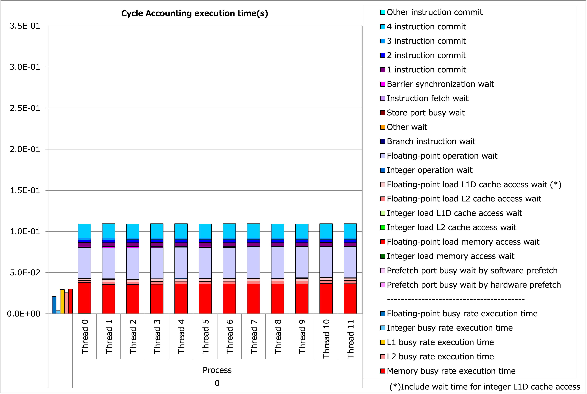
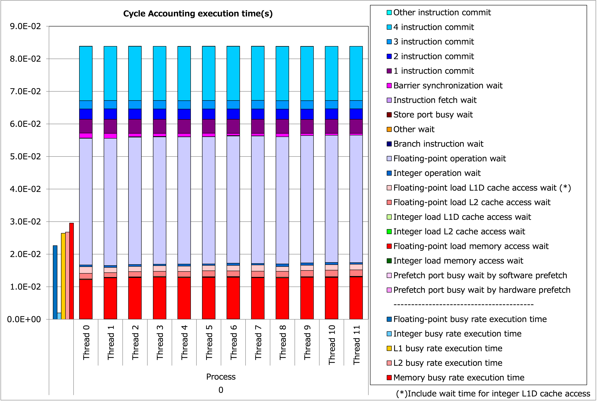
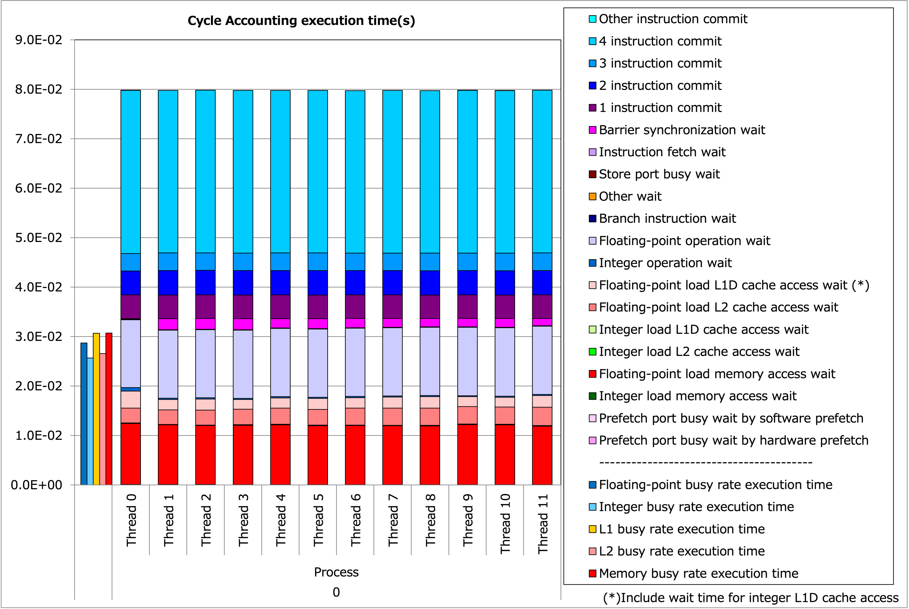

.. axhelm documentation master file, created by
   sphinx-quickstart on Wed Jun 22 17:36:25 2022.
   You can adapt this file completely to your liking, but it should at least
   contain the root `toctree` directive.

.. Welcome to axhelm's documentation!
   ==================================

.. toctree::
   :maxdepth: 2
   :hidden:
   :caption: Contents:

   ./tune-1a

.. Indices and tables
   ==================
   
   * :ref:`genindex`
   * :ref:`modindex`
   * :ref:`search`

############
Introduction
############
This article is a tuning case study for Fugaku, based on a reproduction of a work
by Dr. Tsuji at RIKEN R-CCS.
For the original literature, see 
[1]_ (in Japanese) and [2]_.

****************
What it computes
****************
We examine a kernel from "axhelm", a spectral element method (a family of finite element methods). 
It has 8\ :sup:`3` points in a hexahedron element.
To be precise, the order is variable, but in this tuning, we fix it to 8, the SIMD length of double precision.

By multiplying an 8×8 matrix for the vectors of each axis, we have gradients.
It is a quadruple loop in 8\ :sup:`4` (loop-2a).

Next, we multiply a 3×3 symmetric matrix of geometry factors.
This connects the internal coordinates of the element with the external ones, including the waiting by volume and density.
This part is a triple loop in 8\ :sup:`3`, with a relatively large data fetching of 6×8\ :sup:`3` words (loop-2b).

Loop-2a and Loop-2b are fused to save space for intermediate variables.
From these to loop-3, we need storage of
3×8\ :sup:`3` 
words, which is 12 KiB and fits into the 64 KiB L1 cache.

Finally, we multiply the transposed matrix of the previous gradients. 

Mathematically, this kernel applies a matrix

.. math::

	A=
	\begin{pmatrix}
	D_1 \\ D_2 \\ D_3
	\end{pmatrix}^T
	\begin{pmatrix}
	G_{11} & G_{12} & G_{13} \\
	G_{12} & G_{22} & G_{23} \\
	G_{13} & G_{23} & G_{33}
	\end{pmatrix}
	\begin{pmatrix}
	D_1 \\ D_2 \\ D_3
	\end{pmatrix},

from the left to compute
:math:`A \vec{u}`.

To better clarify the role of multiplying the transposed gradients,
consider the following inner product

.. math::

	(\nabla \vec v, \nabla \vec u) = \vec v^T A \vec u.

The kernel omits the final procedure for multiplying
:math:`\vec v^T`
from the above.
For more detailed formulations, see [3]_.

*************
Organizations
*************

This article starts with an "as-is" :ref:`tune-0<tune-0>`,
and in :ref:`tune-1<tune-1>`,  it improves the SIMD conversion.
The next :ref:`tune-2<tune-2>` avoids gathering instructions
by making continuous access, and 
:ref:`tune-3<tune-3>`
promotes software pipelining by collapsing loops.
Finally, in
:ref:`tune-4<tune-4>`,
we improve the memory access performance by enabling prefetch instruction insertion. 
In :ref:`tune-1a<tune-1a>`,
an equivalent SIMD conversion to
:ref:`tune-1<tune-1>`
without using directives is also introduced.

.. _tune-0:

##########################
As-is performance (tune-0)
##########################

Below is the baseline code.

.. literalinclude:: ../../cpp/axhelm-0.cpp
   :language: cpp
   :tab-width: 4
   :lines: 49-
   :linenos:
   :lineno-match:
   :emphasize-lines: 47,65
   :caption: axhelm-0.cpp

Compiling with a Fujitsu compiler
4.8.0 (tcsds-1.2.35)
in a trad mode with options
``-Kfast,openmp,ocl,optmsg=2``,
and running at a 2.0 GHz frequency results in
a performance of **126 GFLOP/s** per node.

We use a standard combination of numbers, 4 MPI processes per node, and 12 threads per process.
The problem size is 7680 elements.
The GFLOP/s number is calculated by the program from the theoretical operation count
and can differ from what the profiler outputs.

.. なお、この時点で詳細プロファイラを用いても結果の解釈が悩ましいため、
   :ref:`tune-1<tune-1>`
   の結果が得られてから両者の結果を比較することとします。

Let us first examine SIMD conversion.

.. _tune-1:

########################
SIMD conversion (tune-1)
########################
	
In the last code, the compiler outputs the following optimization messages (excerpt):

.. code-block:: none
   :emphasize-lines: 4,9

	  jwd8222o-i  "axhelm-0.cpp", line 78: The prefetch instructions were generated because the number of prefetch required in this loop is greater than the allowable number of hardware-prefetch.
	  jwd8662o-i  "axhelm-0.cpp", line 78: This loop is not software pipelined because no schedule is obtained.
	  jwd8203o-i  "axhelm-0.cpp", line 80: Loop full unrolling is applied to this loop.
	  jwd6004s-i  "axhelm-0.cpp", line 94: SIMD conversion is applied to this loop with the loop variable 'm'. The loop contains a reduction operation.
	  jwd8209o-i  "axhelm-0.cpp", line 100: Evaluation order of polynomial expression is changed according to commutative law of addition and multiplication.
	  jwd8668o-i  "axhelm-0.cpp", line 106: This loop is not software pipelined because the loop contains too many instructions.
	  jwd8203o-i  "axhelm-0.cpp", line 106: Loop full unrolling is applied to this loop.
	  jwd8203o-i  "axhelm-0.cpp", line 108: Loop full unrolling is applied to this loop.
	  jwd6004s-i  "axhelm-0.cpp", line 112: SIMD conversion is applied to this loop with the loop variable 'm'. The loop contains a reduction operation.

We can see that the compiler applies SIMD conversion for the innermost loop index ``m``.
Although vectorization for the innermost loop is standard behavior for most compiles,
this is not an optimal SIMD conversion for the following reasons.
		 
 * One multiplication and one horizontal summation instruction are needed for a dot product 
   calculation of vectors with length 8. This is not efficient
   (if the vector length is sufficiently long, only one horizontal summation is needed
   after several SIMD multiply-add operations, and it is adequate).
 * SIMD conversion is only applied for the gradient calculation part,
   and no SIMD instruction is used for the geometry factor part.

For this reason, we focus on applying SIMD conversion, not for the innermost loop index ``m``,
but one more outer loop index ``i``.
A simple way to do this is to unroll the innermost m-loop.
Fortunately, a compiler directive is available for this purpose,
and we do not need to hand-unroll it.
A modified loop writes:

.. literalinclude:: ../../cpp/axhelm-1.cpp
   :language: cpp
   :tab-width: 4
   :linenos:
   :lineno-match:
   :lines: 94-99
   :caption: axhelm-1.cpp

.. literalinclude:: ../../cpp/axhelm-1.cpp
   :language: cpp
   :tab-width: 4
   :linenos:
   :lineno-match:
   :lines: 113-118

For these two parts,
the compiler first unrolls the innermost m-loops,
then applies SIMD conversion for the outer i-loops.
The compiler message is as follows.

.. code-block:: none
   :emphasize-lines: 5,6,9,10

     jwd8203o-i  "axhelm-1.cpp", line 71: Loop full unrolling is applied to this loop.
     jwd6001s-i  "axhelm-1.cpp", line 72: SIMD conversion is applied to this loop with the loop variable 'i'.
     jwd8668o-i  "axhelm-1.cpp", line 78: This loop is not software pipelined because the loop contains too many instructions.
     jwd8203o-i  "axhelm-1.cpp", line 78: Loop full unrolling is applied to this loop.
     jwd6001s-i  "axhelm-1.cpp", line 80: SIMD conversion is applied to this loop with the loop variable 'i'.
     jwd8203o-i  "axhelm-1.cpp", line 95: Loop full unrolling is applied to this loop.
     jwd8662o-i  "axhelm-1.cpp", line 107: This loop is not software pipelined because no schedule is obtained.
     jwd8203o-i  "axhelm-1.cpp", line 107: Loop full unrolling is applied to this loop.
     jwd6001s-i  "axhelm-1.cpp", line 109: SIMD conversion is applied to this loop with the loop variable 'i'.
     jwd8203o-i  "axhelm-1.cpp", line 114: Loop full unrolling is applied to this loop.

This change yields a performance of
**329 GFLOP/s**.

An equivalent SIMD conversion without directives is described in
:ref:`tune-1a`.

Here is a comparison of statistics and time breakdown 
with :ref:`tune-0<tune-0>`
by Fujitsu Advanced Performance Profiler (FAPP).
The statistics per CMG (1 MPI process, 12 threads) are as follows.

+------------+-------------+--------+---------------+---------------+--------------+---------------+--------------+----------------+-------------+----------------+--------+--------+
| Statistics | | Execution | Gflops | | Floating-   |  | Memory     | | Memory     | | Effective   | | Floating-  | | SIMD         | | SVE       | | Floating-    | IPC    | GIPS   |
|            | | time (s)  |        | | point       |  | throughput | | throughput | | instruction | | point      | | instruction  | | operation | | point        |        |        |
|            |             |        | | operation   |  | (GB/s)     | | peak ratio |               | | operation  | | rate (%)     | | rate (%)  | | pipeline     |        |        |
|            |             |        | | peak  ratio |               | | (%)        |               |              | | (/Effective  |             | | Active       |        |        |
|            |             |        | | (%)         |               |              |               |              | | instruction) |             | | element rate |        |        |
|            |             |        |               |               |              |               |              |                |             |                |        |        |
+============+=============+========+===============+===============+==============+===============+==============+================+=============+================+========+========+
| Tune-0     | 3.13E-01    | 65.71  | 8.56%         | 24.95         | 9.75%        | 7.97E+09      | 2.05E+10     | 57.06%         | 91.87%      | 92.29%         | 1.06   | 25.50  |
+------------+-------------+--------+---------------+---------------+--------------+---------------+--------------+----------------+-------------+----------------+--------+--------+
| Tune-1     | 1.09E-01    | 96.30  | 12.54%        | 70.31         | 27.42%       | 2.08E+09      | 1.05E+10     | 75.41%         | 100.0%      | 91.77%         | 0.79   | 19.06  |
+------------+-------------+--------+---------------+---------------+--------------+---------------+--------------+----------------+-------------+----------------+--------+--------+

Execution time is the most objective indicator and is reduced by almost one-third.
The increase in Gflops number is relatively moderate.
This is because :ref:`tune-0<tune-0>` counts more floating-point operations than it should 
due to the horizontal summation instruction.
The number of floating-point operations in the subsequent tunings below does not increase or reduce.
As a whole, reducing the number of instructions by the SIMD conversion of almost all 
floating-point operations in :ref:`tune-1<tune-1>`
contributes to decreasing total execution time.

Breakdowns of execution times are as follows.

.. figure:: ../../figure/tune0_035.png
	:width: 640

	Breakdown of tune-0

	Breakdown of tune-1

So far, we have seen that the reduction in the total operation count has reduced execution time.
However, there remains several rooms for improvement in :ref:`tune-1<tune-1>`

 * Light purple-colored "floating-point operation wait" time occupies a significant fraction of the total time.
   Compiler-based scheduling, like **software pipelining**, can improve this (:ref:`tune-3<tune-3>`).
 * Red colored "floating-point load memory access wait" has also a certain fraction in the total execution time.
   Ultimately, this kernel will end up with a memory-bound problem. However, the current memory busy rate is only 24.42%.
   Insertion of **software prefetch** may improve this part (:ref:`tune-4<tune-4>`).

.. _tune-2:

#############################################
Avoid gathering by continuous access (tune-2)
#############################################

In the previous SIMD conversion, some inefficient memory access remain.

.. literalinclude:: ../../cpp/axhelm-1.cpp
   :language: cpp
   :tab-width: 4
   :linenos:
   :lineno-match:
   :lines: 95-99
   :emphasize-lines: 2
   :caption: axhelm-1.cpp

This is a vectorization on the index ``[i]``,
so the first line is a vector-scalar multiplication, and the other two lines are scalar-vector multiplication.
The array ``s_D[i][m]`` in the first line includes the index ``[i]`` and can be vectorized.
However, the index resides not the innermost, resulting in a stride or gathering memory access.
The gather load instruction can be found from the compiler output as:

.. code-block:: none

	/*     96 */    index   z17.d, 0, 8
	/*     96 */    ld1d    {z16.d}, p0/z, [x16, z17.d, lsl #3]     //  "s_D"

Without reading an assembly output, one can also check the issues of gathering instructions from a FAPP report.

.. figure:: ../../figure/tune1_xls.png
	:width: 500

	FAPP report for tune-1

Fortunately, this matrix is tiny, 8×8, and shared for all elements.
Thus, we can prepare a transposed matrix at the function's entry.
The following are code changes for such tuning.

.. literalinclude:: ../../cpp/axhelm-2.cpp
   :language: cpp
   :tab-width: 4
   :linenos:
   :lineno-match:
   :lines: 62-70
   :caption: axhelm-2.cpp
   :emphasize-lines: 6

.. literalinclude:: ../../cpp/axhelm-2.cpp
   :language: cpp
   :tab-width: 4
   :linenos:
   :lineno-match:
   :lines: 97-101
   :emphasize-lines: 2

A new array ``s_T[i][j]`` contains a transpose of the original matrix ``s_D[j][i]``. 
This change yeelded a performance of **358 GFLOPS/s**
(+8.8% from :ref:`tune-1<tune-1>`).

.. _tune-3:

###############################################
Software pipelining by loop collapsing (tune-3)
###############################################

The inner i-loop with the SIMD length 8 is efficiently vectorized.
Now we focus on one outer j-loop for better instruction scheduling, like software pipelining. 
The j-loop has a fixed size of 8, known at the compile time.
Thus, for the current version, the compiler applies full unrolling of the j-loop.
For the k-loop, the compiler gives no modification because its loop body is big enough. 

Here, we *collapse* the j-loop and k-loop to generate a single loop with a length of 64
to improve the scheduling.
OpenMP supports loop collapsing for cases where the length of the outermost loop is not long enough for
thread parallelization. 
Still, there seems to be no directive for loop collapsing without thread
parallelization.
We do it by hand.

.. literalinclude:: ../../cpp/axhelm-3.cpp
   :language: cpp
   :tab-width: 4
   :linenos:
   :lineno-match:
   :lines: 84-86
   :caption: axhelm-3.cpp

The same change is applied for three parts, and the compiler messages are:

.. code-block:: none
   :emphasize-lines: 1-2,4-5,8-9

     jwd8204o-i  "axhelm-3.cpp", line 73: This loop is software pipelined.
     jwd8205o-i  "axhelm-3.cpp", line 73: The software-pipelined loop is chosen at run time when the iteration count is greater than or equal to 64.
     jwd6001s-i  "axhelm-3.cpp", line 77: SIMD conversion is applied to this loop with the loop variable 'i'.
     jwd8204o-i  "axhelm-3.cpp", line 84: This loop is software pipelined.
     jwd8205o-i  "axhelm-3.cpp", line 84: The software-pipelined loop is chosen at run time when the iteration count is greater than or equal to 48.
     jwd6001s-i  "axhelm-3.cpp", line 88: SIMD conversion is applied to this loop with the loop variable 'i'.
     jwd8203o-i  "axhelm-3.cpp", line 103: Loop full unrolling is applied to this loop.
     jwd8204o-i  "axhelm-3.cpp", line 115: This loop is software pipelined.
     jwd8205o-i  "axhelm-3.cpp", line 115: The software-pipelined loop is chosen at run time when the iteration count is greater than or equal to 48.
     jwd6001s-i  "axhelm-3.cpp", line 119: SIMD conversion is applied to this loop with the loop variable 'i'.
     jwd8203o-i  "axhelm-3.cpp", line 124: Loop full unrolling is applied to this loop.

This modification resulted in 
**374 GFLOP/s**
(+4.5% from :ref:`tune-2<tune-2>`).

Let us compare the FAPP report with :ref:`tune-2<tune-2>`.

	Breakdown of tune-2

	Breakdown of tune-3

At a glance, the light purple-colored "Floating-point operation wait" is much reduced,
but we have more blue-colored "4 instruction commit" instead,
resulting in a slight improvement in the total time.
This is due to the increased integer instructions in the software pipelined version.
For example, the IPC number changes to 1.01→2.01, and the GIPS number per core 2.03→4.02,
that is, one more instruction for every CPU cycle.
This does not mean that the increase of the integer instruction canceled the
improvement by the software pipelining.
Still, the density of floating-point operations increases slightly
with the concurrent execution of the additional integer instructions.

The limited scheduling improvement is because
full unrolling has already been performed on the loop variable 
``j`` for its fixed length 8 in :ref:`tune-1<tune-1>`,
and moderate scheduling has already been available.
Although the performance gain in this tuning is limited,
the loop collapse introduced here is essential
in the subsequent tuning.

.. _tune-4:

###################################
Enabling software prefetch (tune-4)
###################################

A redundant address calclation remains in the code up to this point.

.. literalinclude:: ../../cpp/axhelm-3.cpp
   :language: cpp
   :tab-width: 4
   :linenos:
   :lineno-match:
   :lines: 84-96
   :caption: axhelm-3.cpp
   :emphasize-lines: 7

Here, ``ggeo`` corresponds to a multidimensional array ``double ggeo[Nelements][7][512]`` (``p_Np=512``).
After the loops are collapsed, the address can be directly calculated from the loop variable ``kj``
(since ``k * p_Nq * p_Nq + j * p_Nq == kj * p_Nq``).

.. literalinclude:: ../../cpp/axhelm-4.cpp
   :language: cpp
   :tab-width: 4
   :linenos:
   :lineno-match:
   :lines: 84-90
   :caption: axhelm-4.cpp
   :emphasize-lines: 7

Although It appears to be a tiny saving in integer operations,
the performance is significant, reaching **606 GFLOP/s** (+62% from :ref:`tune-3<tune-3>`).
This is because the address calculation becomes just linear to the loop variable ``kj``, 
enabling the compiler to output software prefetch instructions.
This time, we could not find any report for the insertion of the prefetch instructions
from the optimization message of the compiler, but it can be confirmed from the assembly output.

.. code-block:: none
   :caption: Excerpt from "$ grep -n prfm axhelm-4.s"

	1313:/*     91 */	prfm	2, [x30, 824]  // PLDL2KEEP for 00010 
	1320:/*     91 */	prfm	0, [x30, 312]  // PLDL1KEEP for 00000
	4324:/*    130 */	prfm	18, [x12, 760] // PSTL2KEEP for 10010
	4325:/*    130 */	prfm	16, [x12, 248] // PSTL1KEEP for 10000

For the detail of the instructions, see [4]_.

In the original literature [1]_ [2]_,
prefetch instructions were manually inserted in the final stage of tunings,
while the compiler inserts them in this version.

The FAPP report for this version is as follows.

.. figure:: ../../figure/tune4_09.png
	:width: 640

	Breakdown of tune-4

The red-colored memory waiting time is improved.
Also, memory busy time (red vertical bar on the left)
is reduced to below 3.0E-02, indicating that memory accesses
are reduced due to prefetching.

----

#######
Summary
#######

Below are the kernels, tunings used, and their performances.

.. csv-table::
    :widths: 15, 35, 15

	Kernel,Tuning,GFLOP/s
	tune-0,as-is,126
	tune-1,SIMD conversion,329
	tune-1a,SIMD (alternative),321
	tune-2,Continuous access,358
	tune-3,Software pipelining,374
	tune-4,Prefetch,606

The most significant improvement was achieved in the first tuning;
SIMD conversion in an adequate loop index.
The final tuning enabling the compiler prefetching is also highly effective,
which owes to the loop collapsing in :ref:`tune-3<tune-3>`.

##########
References
##########

.. [1] 辻，佐藤 (2021) 『A64FX に向けたNeK CFD solverにおける axhelm カーネルの最適化と評価』 http://id.nii.ac.jp/1001/00214101

.. [2] Tsuji *et al*. (2022) "Performance tuning of the Helmholtz matrix-vector product kernel in the computational fluid dynamics solver Nek5000/RS for the A64FX processor" https://doi.org/10.1145/3503470.3503476

.. [3] Fischer *et al*. (2021) "NekRS, a GPU-Accelerated Spectral Element Navier-Stokes Solver" https://arxiv.org/abs/2104.05829

.. [4] Arm A-profile A64 Instruction Set Architecture `PRFM (immidiate) <https://developer.arm.com/documentation/ddi0602/2022-09/Base-Instructions/PRFM--immediate---Prefetch-Memory--immediate--?lang=en>`_
